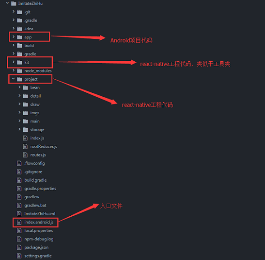
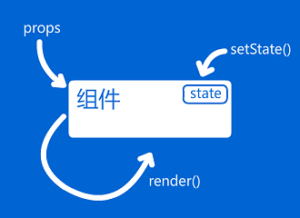
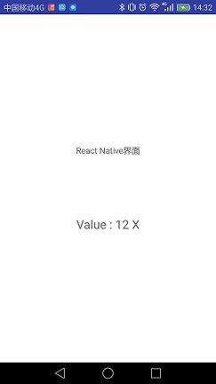
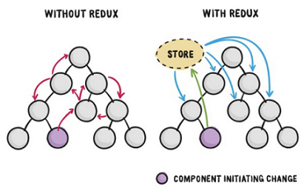
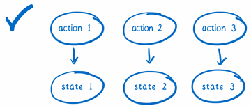
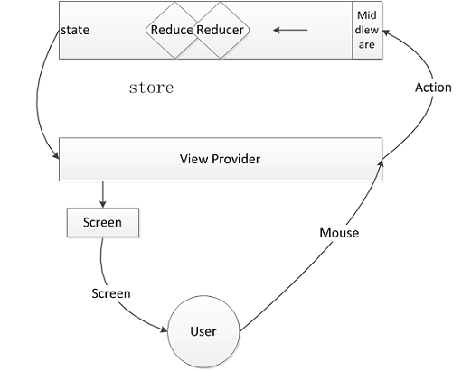

[点击此处修改文章](https://github.com/DaiQing-Zha/pageSource/blob/master/_posts/react-native-redux-simple-tutorial.md)

### 一、React-Native介绍
**简介：**  
React Native (简称RN)是Facebook于2015年4月开源的跨平台移动应用开发框架，是Facebook早先开源的UI框架 React 在原生移动应用平台的衍生产物，目前支持iOS和安卓两大平台。RN使用Javascript语言，类似于HTML的JSX，以及CSS来开发移动应用。  
**React-native特点：**  
1、React Native使你能够在Javascript和React的基础上获得完全一致的开发体验，构建世界一流的原生APP。  
2、React Native着力于提高多平台开发的开发效率 —— 仅需学习一次，编写任何平台。(Learn once, write anywhere)  
**React Native比起标准Web开发或原生开发能够带来的三大好处：**  
1、手势识别：基于Web技术（HTML5/JavaScript）构建的移动应用经常被抱怨缺乏及时响应。而基于原生UI的React Native能避免这些问题从而实现实时响应。  
2、原生组件：使用HTML5/JavaScript实现的组件比起原生组件总是让人感觉差一截，而React Native由于采用了原生UI组件自然没有此问题。  
3、样式和布局：iOS、Android和基于Web的应用各自有不同的样式和布局机制。React Native通过一个基于FlexBox的布局引擎在所有移动平台上实现了一致的跨平台样式和布局方案。

### 二、环境搭建
参考资料：
1、[Node.js安装及环境配置之Windows篇](http://www.jianshu.com/p/03a76b2e7e00)  
2、[Windows下RN环境搭建及官方Demo运行](http://m.blog.csdn.net/M075097/article/details/76551303)


### 三、Android中集成React-Native  
参考资料：
[Android原生项目集成React Native](http://blog.csdn.net/u013718120/article/details/55050900?locationNum=15&fps=1)  

详细步骤如下：
1、创建Android工程：ImitateZhiHu  
2、工程创建完毕后，切换到Android Studio的terminal命令行窗口，执行npm init命令，将工程初始化为一个react-native工程（**npm init 会生成package.json文件，即RN的配置文，一个文件要被其它模块作为工具包引用，一定要有个package.json**）  

```JSX
{
  "name": "kit",
  "version": "1.0.0",
  "description": "imittezh' react-native uikit",
  "main": "index.js",
  "scripts": {
    "test": "echo \"Error: no test specified\" && exit 1"
  },
  "keywords": [
    "charles",
    "zh",
    "native",
    "uikit"
  ],
  "author": "charles",
  "license": "ISC"
}
```

3、执行npm install --save react react-native 命令  
4、创建.flowconfig文件（可以从其它工程复制）  
5、在package.json中添加"start": "node node_modules/react-native/local-cli/cli.js start"，作用：使得在AndroidStudio中可以支持npm命令  
6、添加index.android.js文件，也就是你的RN界面到根目录下，它是一个入口文件  
7、其它：给项目添加依赖包，网络权限，NDK支持，maven库的本地路径等  
8、以上完成之后，react-native就算集成到了项目中了
### 四、React-Native工程介绍  
#### 4.1、工程目录  
  
#### 4.2、react-native  
##### 4.2.1、react-native的生命周期  
  
**生命周期的三个阶段**  
第一阶段：是组件第一次绘制阶段，如图中的上面虚线框内，在这里完成了组件的加载和初始化；  
第二阶段：是组件在运行和交互阶段，如图中左下角虚线框，这个阶段组件可以处理用户
交互，或者接收事件更新界面；  
第三阶段：是组件卸载消亡的阶段，如图中右下角的虚线框中，这里做一些组件的清理工作  
**生命周期中一些重要方法**  
1、getInitialState  
该函数用于对组件的一些状态进行初始化，该状态是随时变化的（也就是说该函数会被多次调用），比如ListView的datasource,rowData等等，同样的，可以通过this.state.XXX取该属性值，同时可以对该值进行修改，通过this.setState修改，es6中将属性的初始化放到了构造函数中。  
2、render  
该函数组件必有的，通过返回JSX或其他组件来构成DOM,换言之，就是组件的核心渲染过程。  
3、componentDidMount  
在组件第一次绘制之后，会调用componentDidMount，通知组件已经加载完成。
4、shouldComponentUpdate  
当组件接收到新的属性和状态改变的话，都会触发调用shouldComponentUpdate(...)  
##### 4.2.2、hello world 

```JSX
import React, { Component } from 'react';
import {
  AppRegistry,
  StyleSheet,
  Text,
  View
} from 'react-native';

export default class MyFirstRNDemo extends Component {
  render() {
    return (
      <View style={styles.container}>
        <Text style={styles.welcome}>
          Welcome to React Native!
        </Text>
        <Text style={styles.instructions}>
          To get started, edit index.android.js
        </Text>
        <Text style={styles.instructions}>
          Double tap R on your keyboard to reload,{'\n'}
          Shake or press menu button for dev menu
        </Text>
      </View>
    );
  }
}

const styles = StyleSheet.create({
  container: {
    flex: 1,
    justifyContent: 'center',
    alignItems: 'center',
    backgroundColor: '#F5FCFF',
  },
  welcome: {
    fontSize: 20,
    textAlign: 'center',
    margin: 10,
  },
  instructions: {
    textAlign: 'center',
    color: '#333333',
    marginBottom: 5,
  },
});

AppRegistry.registerComponent('MyFirstRNDemo', () => MyFirstRNDemo);
```

1、第一行 import 引入了 React库，React是Facebook开发的一款JS库，主要用于构建那些数据会随时改变的大型应用，第二行：import {...} from 'react-native' 大括号内是一些组件，用于引入一些组件react-native。  
2、class FirstRNDemo 就是我们App界面中要展示的内容了，我们可以看到里面有一个render()方法，这是Component类的一个方法用于渲染界面，他负责将其return回来的View渲染出来。  
3、StyleSheet：样式管理类,类似于css，用于定义一些样式  
4、AppRegistry模块，是用来告知React Native哪一个组件被注册为整个应用的根容器。
使用AppRegistry.registerComponent进行注册自己，然后原生系统就可以进行加载运行bundle文件包，最后就会可以调用AppRegistry.runApplication进行运行起来应用  
##### 4.2.3、props和state
React 把组件看成是一个状态机（State Machines）。通过与用户的交互，实现不同状态，然后渲染 UI，让用户界面和数据保持一致。
**一个标准的React组件会由以下几种情况触发render。一种是通过setState方法设置了state内容，另一种是外部传入了props。**  
  
**props**：大多数组件在创建时就可以使用各种参数来进行定制。用于定制的这些参数就称为props（属性），比如我们可以实现指定一个标题栏名字，或者一张图片的默认地址。  
**state**：我们使用两种数据来控制一个组件：props和state。props是在父组件中指定，而且一经指定，在被指定的组件的生命周期中则不再改变。 对于需要改变的数据，我们需要使用state。一般来说，你需要在constructor中初始化state（译注：这是ES6的写法，早期的很多ES5的例子使用的是getInitialState方法来初始化state，这一做法会逐渐被淘汰），然后在需要修改时调用setState方法。    

```JSX
class Bananas extends Component {
  render() {
    let pic = {
      uri: 'https://upload.wikimedia.org/wikipedia/commons/d/de/Bananavarieties.jpg'
    };
    return (
      <Image source={pic} style={{width: 193, height: 110}} />
    );
  }
}
```

##### 4.2.4、简易计数器  

```JSX
export default class SimpleCounter extends Component {
  constructor(props){
    super(props);
    this.state = {
      mainText: 'init value',numValue: 1
    }
  }
  render() {
    let title = 'React Native界面';
    return (
      <View underlayColor = '#ddd', style={styles.container}>
        <Text >{title}</Text>
        <Text style={styles.welcome}
        onPress={() => this.addNum()}>{this.state.mainText}</Text>
      </View>
    );
  }
  addNum(){
    this.state.numValue ++;
    if(this.state.numValue % 2 == 0){
      this.setState({
        mainText: "Value : " + this.state.numValue + " X"
      });
    }else{
      this.setState({
        mainText: "Value : " + this.state.numValue + " Y"
      });
    }
  }
}
```

#### 4.3、react与redux  
##### 4.3.1、安装redux依赖包  
跟安装其它依赖库一样，通过npm install 命令进行安装，npm install --save react-dedux  
##### 4.3.2、Redux 简介  
redux和 React 之间没有关系。Redux 支持 React、Angular、Ember、jQuery 甚至纯 JavaScript。Redux对于JavaScript应用而言是一个可预测状态的容器。换言之，它是一个应用数据流框架。Redux最主要是用作应用状态的管理。简言之，Redux用一个单独的常量状态树（对象）保存这一整个应用的状态，这个对象不能直接被改变。当一些数据变化了，一个新的对象就会被创建（使用actions和reducers）。  
##### 4.3.3、为什么要用redux  
1、redux的本质，redux要解决的问题就是state的管理  
2、实现UI与控制分离，是一种MVC的分层思想
React扮演的是View的角色，Redux则是Controller，至于Model就是Redux Store中存储的State，不使用redux，项目的耦合性会很大。  
3、便于state控制和维护  
如果保留组件内部的state，那么当你在多处调用这个组件的时候，无法有效管理state的变化，而使用redux可以让state的每一次变化都是可以控制的。  
下图说明了React和Redux的状态流分别是怎么样的  
  
下图说明了使用Redux管理状态为什么是可预测的  
  
##### 4.3.4、redux的处理流程  
[1]redux要做的事情，就是通过action去控制每一个state的状态变化，把所有state放到store上，交给reducer去管理，这样就能确保每一个state的变化是可预测的。  
[2]组件内部应该是纯净的，任何状态的变化都需要dispatch一个action去更新state，然后重新渲染更新的部分，并不会重新渲染所有的View。  
 

##### 4.3.5、redux中一些重要概念  
1、Action  
Action是把数据从应用（译者注：这里之所以不叫 view 是因为这些数据有可能是服务器响应，用户输入或其它非 view 的数据 ）传到 store 的有效载荷。它是 store 数据的唯一来源。一般来说你会通过store.dispatch()将 action 传到 store。  
2、Store  
前面我们知道使用action来描述“发生了什么”，和使用reducers来根据 action 更新 state 的用法。而Store就是把它们联系到一起的对象。  
3、Provider  
Provider是一个普通组件，可以作为顶层app的分发点，它只需要store属性就可以了。它会将state分发给所有被connect的组件，不管它在哪里，被嵌套多少层。
Provider干的事：接收store，并将store传到子组件中，当store发生变化时，更新store；所以子组件具有store的dispatch方法。  
4、connect  
connect是一个方法，我们可以通过export default connect(select)(App) 绑定Redux与React，连接 React 组件与 Redux store。
connect干的事：定义了一个新的组件Connect，经过一系列的merge后，将各种值挂载props上传递到原组件。 Connect组件会保存state状态，同时监听Redux Store的变化，从而触发原组件的更新。
mapStateToProps ：mapStateToProps是一个函数。它的作用就是像它的名字那样，建立一个从（外部的）state对象到（UI 组件的）props对象的映射关系。作为函数，mapStateToProps执行后应该返回一个对象，里面的每一个键值对就是一个映射。请看下面的例子：
```JSX
export default connect((state) => {
return {
        mainStore: state.mainStore,
    }
})(PageMain);
```
mapStateToProps会订阅 Store，每当state更新的时候，就会自动执行，重新计算 UI 组件的参数，从而触发 UI 组件的重新渲染。
connect方法可以省略mapStateToProps参数，那样的话，UI 组件就不会订阅Store，就是说 Store 的更新不会引起 UI 组件的更新。